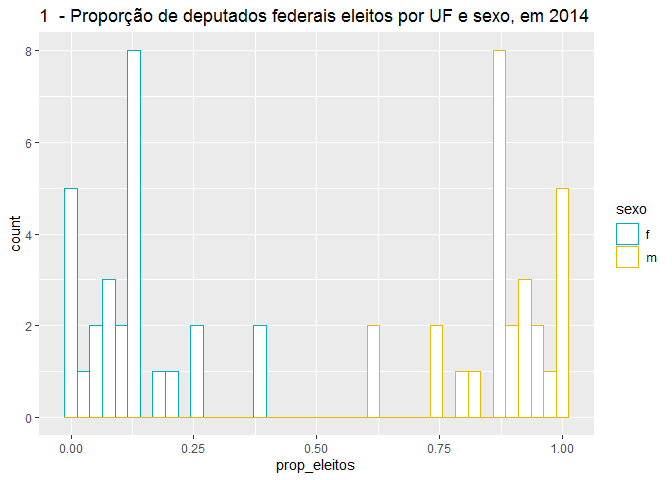
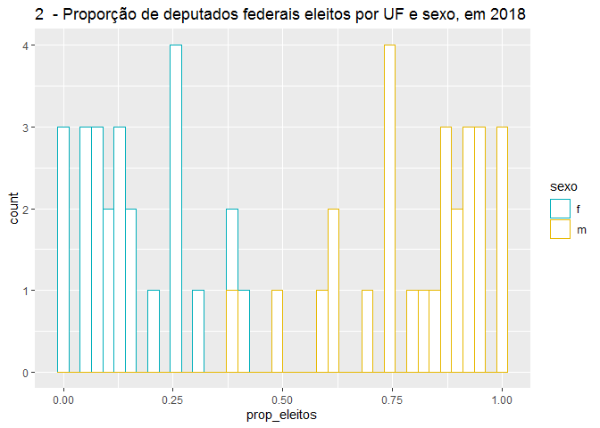
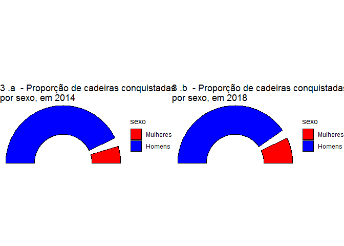
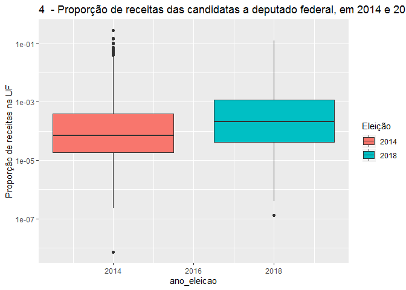
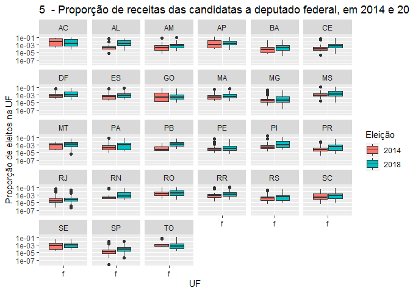
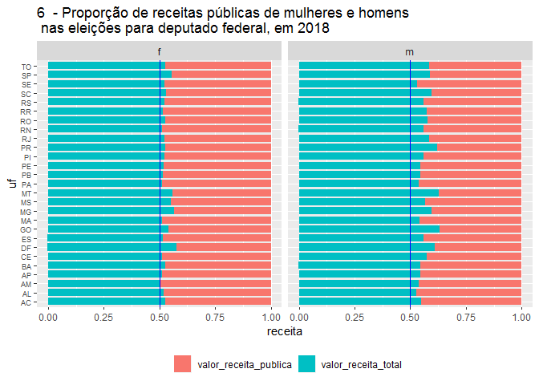
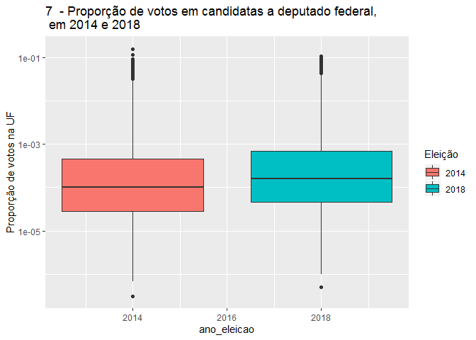
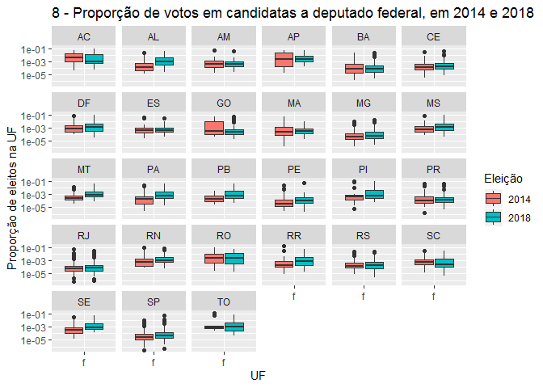

Por que houve mais deputadas federais em 2018?
================
Marcus Vinicius Chevitarese Alves, Ângela Batista Oliveira
17/02/2020

## Carrega as bibliotecas necessárias

``` r
library(tidyverse)
library(gridExtra)
library(ggpol)
library(data.table)
library(xltabr)
```

## Carrega arquivos de frequência de eleitos e eleitas em 2014 e 2018.

``` r
arq_freq_2014 <- "dados/freq_eleitos_uf_2014.csv"
arq_freq_2018 <- "dados/freq_eleitos_uf_2018.csv"

data_freq_2014_origem <- read.csv(arq_freq_2014, sep=";")
head(data_freq_2014_origem, 10)
```

    ##    uf sexo n_eleitos
    ## 1  AC    f         1
    ## 2  AL    f         0
    ## 3  AM    f         1
    ## 4  AP    f         3
    ## 5  BA    f         3
    ## 6  CE    f         2
    ## 7  DF    f         1
    ## 8  ES    f         0
    ## 9  GO    f         2
    ## 10 MA    f         1

``` r
data_freq_2018_origem <- read.csv(arq_freq_2018, sep=";")
head(data_freq_2018_origem, 10)
```

    ##    uf sexo n_eleitos
    ## 1  AC    f         4
    ## 2  AL    f         1
    ## 3  AM    f         0
    ## 4  AP    f         3
    ## 5  BA    f         3
    ## 6  CE    f         1
    ## 7  DF    f         5
    ## 8  ES    f         3
    ## 9  GO    f         2
    ## 10 MA    f         0

## a. Estrutura dos dados e análise exploratória dos candidatos eleitos a deputado federal em 2014 e 2018

### a.1. Estrutura dos dados 2014

``` r
str(data_freq_2014_origem)
```

    ## 'data.frame':    54 obs. of  3 variables:
    ##  $ uf       : Factor w/ 27 levels "AC","AL","AM",..: 1 2 3 4 5 6 7 8 9 10 ...
    ##  $ sexo     : Factor w/ 2 levels "f","m": 1 1 1 1 1 1 1 1 1 1 ...
    ##  $ n_eleitos: int  1 0 1 3 3 2 1 0 2 1 ...

``` r
summary(data_freq_2014_origem)
```

    ##        uf     sexo     n_eleitos    
    ##  AC     : 2   f:27   Min.   : 0.00  
    ##  AL     : 2   m:27   1st Qu.: 2.00  
    ##  AM     : 2          Median : 5.50  
    ##  AP     : 2          Mean   : 9.50  
    ##  BA     : 2          3rd Qu.: 9.75  
    ##  CE     : 2          Max.   :64.00  
    ##  (Other):42

### a.2. Estrutura dos dados 2018

``` r
str(data_freq_2018_origem)
```

    ## 'data.frame':    54 obs. of  3 variables:
    ##  $ uf       : Factor w/ 27 levels "AC","AL","AM",..: 1 2 3 4 5 6 7 8 9 10 ...
    ##  $ sexo     : Factor w/ 2 levels "f","m": 1 1 1 1 1 1 1 1 1 1 ...
    ##  $ n_eleitos: int  4 1 0 3 3 1 5 3 2 0 ...

``` r
summary(data_freq_2018_origem)
```

    ##        uf     sexo     n_eleitos    
    ##  AC     : 2   f:27   Min.   : 0.00  
    ##  AL     : 2   m:27   1st Qu.: 2.25  
    ##  AM     : 2          Median : 5.00  
    ##  AP     : 2          Mean   : 9.50  
    ##  BA     : 2          3rd Qu.:10.75  
    ##  CE     : 2          Max.   :59.00  
    ##  (Other):42

### a.3. Total e proporção de eleitos por UF em 2014

``` r
data_freq_2014 <- data_freq_2014_origem %>%
  group_by(uf) %>%
  mutate(prop_eleitos = n_eleitos / sum(n_eleitos)) %>%
  ungroup()

data_freq_2014
```

    ## # A tibble: 54 x 4
    ##    uf    sexo  n_eleitos prop_eleitos
    ##    <fct> <fct>     <int>        <dbl>
    ##  1 AC    f             1       0.125 
    ##  2 AL    f             0       0     
    ##  3 AM    f             1       0.125 
    ##  4 AP    f             3       0.375 
    ##  5 BA    f             3       0.0769
    ##  6 CE    f             2       0.0909
    ##  7 DF    f             1       0.125 
    ##  8 ES    f             0       0     
    ##  9 GO    f             2       0.118 
    ## 10 MA    f             1       0.0556
    ## # ... with 44 more rows

### a.4. Total e proporção de eleitos por UF em 2018

``` r
data_freq_2018 <- data_freq_2018_origem %>%
  group_by(uf) %>%
  mutate(prop_eleitos = n_eleitos / sum(n_eleitos)) %>%
  ungroup()

data_freq_2018
```

    ## # A tibble: 54 x 4
    ##    uf    sexo  n_eleitos prop_eleitos
    ##    <fct> <fct>     <int>        <dbl>
    ##  1 AC    f             4       0.5   
    ##  2 AL    f             1       0.111 
    ##  3 AM    f             0       0     
    ##  4 AP    f             3       0.375 
    ##  5 BA    f             3       0.0769
    ##  6 CE    f             1       0.0455
    ##  7 DF    f             5       0.625 
    ##  8 ES    f             3       0.3   
    ##  9 GO    f             2       0.118 
    ## 10 MA    f             0       0     
    ## # ... with 44 more rows

### a.5. Desenha histograma da proporção de deputados federais eleitos por UF e sexo, em 2014

``` r
n_fig <- 1
ggplot(data_freq_2014, aes(x = prop_eleitos)) +
  geom_histogram(aes(color = sexo), fill = "white",
    position = "identity", bins = 40) +
  scale_color_manual(values = c("#00AFBB", "#E7B800")) +
  ggtitle(paste(n_fig, " - Proporção de deputados federais eleitos por UF e sexo, em 2014"))
```

<!-- -->

### a.6. Desenha histograma da proporção de deputados federais eleitos por UF e sexo, em 2018

``` r
n_fig <- n_fig + 1
ggplot(data_freq_2018, aes(x = prop_eleitos)) +
  geom_histogram(aes(color = sexo), fill = "white",
    position = "identity", bins = 40) +
  scale_color_manual(values = c("#00AFBB", "#E7B800")) +
  ggtitle(paste(n_fig, " - Proporção de deputados federais eleitos por UF e sexo, em 2018"))
```

<!-- -->

### a.7. Interpretação dos histogramas de proporção de eleitos

Analisando os dois histogramas, percebemos que a distribuição da
proporção de eleitos em 2018 ficou um pouco mais equitativa em relação
ao 2014. No primeiro histograma, há uma divisão clara entre homens e
mulheres, sendo que, em nenhuma unidade da federação os homens obtiveram
menos de 50% das cadeiras. Já em 2018, houve dois casos onde isso
ocorreu.

### a.8. Quantitativo e proporção de eleitos para deputado federal por sexo, em 2014

``` r
tab_eleitos_uf_sexo_2014 <- xtabs(n_eleitos ~ uf + sexo, data_freq_2014)
tab_prop_eleitos_uf_sexo_2014 <- prop.table(tab_eleitos_uf_sexo_2014, c(1))
tab_prop_eleitos_uf_sexo_2014 <- addmargins(tab_prop_eleitos_uf_sexo_2014, c(2))

tab_eleitos_uf_sexo_2014 <- addmargins(tab_eleitos_uf_sexo_2014)
cat("Quantitativo de eleitos - 2014", "\n")
```

    ## Quantitativo de eleitos - 2014

``` r
tab_eleitos_uf_sexo_2014
```

    ##      sexo
    ## uf      f   m Sum
    ##   AC    1   7   8
    ##   AL    0   9   9
    ##   AM    1   7   8
    ##   AP    3   5   8
    ##   BA    3  36  39
    ##   CE    2  20  22
    ##   DF    1   7   8
    ##   ES    0  10  10
    ##   GO    2  15  17
    ##   MA    1  17  18
    ##   MG    5  48  53
    ##   MS    1   7   8
    ##   MT    0   8   8
    ##   PA    3  14  17
    ##   PB    0  12  12
    ##   PE    1  24  25
    ##   PI    2   8  10
    ##   PR    2  28  30
    ##   RJ    6  40  46
    ##   RN    1   7   8
    ##   RO    2   6   8
    ##   RR    2   6   8
    ##   RS    1  30  31
    ##   SC    2  14  16
    ##   SE    0   8   8
    ##   SP    6  64  70
    ##   TO    3   5   8
    ##   Sum  51 462 513

``` r
cat("\n", "Proporção de eleitos - 2014", "\n")
```

    ## 
    ##  Proporção de eleitos - 2014

``` r
tab_prop_eleitos_uf_sexo_2014
```

    ##     sexo
    ## uf            f          m        Sum
    ##   AC 0.12500000 0.87500000 1.00000000
    ##   AL 0.00000000 1.00000000 1.00000000
    ##   AM 0.12500000 0.87500000 1.00000000
    ##   AP 0.37500000 0.62500000 1.00000000
    ##   BA 0.07692308 0.92307692 1.00000000
    ##   CE 0.09090909 0.90909091 1.00000000
    ##   DF 0.12500000 0.87500000 1.00000000
    ##   ES 0.00000000 1.00000000 1.00000000
    ##   GO 0.11764706 0.88235294 1.00000000
    ##   MA 0.05555556 0.94444444 1.00000000
    ##   MG 0.09433962 0.90566038 1.00000000
    ##   MS 0.12500000 0.87500000 1.00000000
    ##   MT 0.00000000 1.00000000 1.00000000
    ##   PA 0.17647059 0.82352941 1.00000000
    ##   PB 0.00000000 1.00000000 1.00000000
    ##   PE 0.04000000 0.96000000 1.00000000
    ##   PI 0.20000000 0.80000000 1.00000000
    ##   PR 0.06666667 0.93333333 1.00000000
    ##   RJ 0.13043478 0.86956522 1.00000000
    ##   RN 0.12500000 0.87500000 1.00000000
    ##   RO 0.25000000 0.75000000 1.00000000
    ##   RR 0.25000000 0.75000000 1.00000000
    ##   RS 0.03225806 0.96774194 1.00000000
    ##   SC 0.12500000 0.87500000 1.00000000
    ##   SE 0.00000000 1.00000000 1.00000000
    ##   SP 0.08571429 0.91428571 1.00000000
    ##   TO 0.37500000 0.62500000 1.00000000

``` r
# cross_tab <- reshape2::dcast(data_freq_2014, uf ~ sexo, value.var = "n_eleitos", 
#                                             margins=c("uf", "sexo"), fun.aggregate = sum)
# 
# 
# titulos = c("Proporção de eleitos em 2014", "Cruzamento por UF e sexo do candidato")
# tab_eleitos_uf_sexo_2014 <- xltabr::auto_crosstab_to_wb(cross_tab, titles = titulos)
# openxlsx::openXL(tab_eleitos_uf_sexo_2014)
# 
# cross_tab <- reshape2::dcast(data_freq_2018, uf ~ sexo, value.var = "n_eleitos", 
#                                             margins=c("uf", "sexo"), fun.aggregate = sum)
# 
# 
# titulos = c("Proporção de eleitos em 2018", "Cruzamento por UF e sexo do candidato")
# tab_eleitos_uf_sexo_2018 <- xltabr::auto_crosstab_to_wb(cross_tab, titles = titulos)
# openxlsx::openXL(tab_eleitos_uf_sexo_2018)
```

### a.9. Quantitativo e proporção de eleitos para deputado federal por sexo, em 2018

``` r
tab_eleitos_uf_sexo_2018 <- xtabs(n_eleitos ~ uf + sexo, data_freq_2018)
tab_prop_eleitos_uf_sexo_2018 <- prop.table(tab_eleitos_uf_sexo_2018, c(1))
tab_prop_eleitos_uf_sexo_2018 <- addmargins(tab_prop_eleitos_uf_sexo_2018, c(2))

tab_eleitos_uf_sexo_2018 <- addmargins(tab_eleitos_uf_sexo_2018)
cat("Quantitativo de eleitos - 2018", "\n")
```

    ## Quantitativo de eleitos - 2018

``` r
tab_eleitos_uf_sexo_2018
```

    ##      sexo
    ## uf      f   m Sum
    ##   AC    4   4   8
    ##   AL    1   8   9
    ##   AM    0   8   8
    ##   AP    3   5   8
    ##   BA    3  36  39
    ##   CE    1  21  22
    ##   DF    5   3   8
    ##   ES    3   7  10
    ##   GO    2  15  17
    ##   MA    0  18  18
    ##   MG    4  49  53
    ##   MS    2   6   8
    ##   MT    1   7   8
    ##   PA    1  16  17
    ##   PB    1  11  12
    ##   PE    1  24  25
    ##   PI    4   6  10
    ##   PR    5  25  30
    ##   RJ   10  36  46
    ##   RN    1   7   8
    ##   RO    3   5   8
    ##   RR    2   6   8
    ##   RS    3  28  31
    ##   SC    4  12  16
    ##   SE    0   8   8
    ##   SP   11  59  70
    ##   TO    2   6   8
    ##   Sum  77 436 513

``` r
cat("\n", "Proporção de eleitos - 2018", "\n")
```

    ## 
    ##  Proporção de eleitos - 2018

``` r
tab_prop_eleitos_uf_sexo_2018
```

    ##     sexo
    ## uf            f          m        Sum
    ##   AC 0.50000000 0.50000000 1.00000000
    ##   AL 0.11111111 0.88888889 1.00000000
    ##   AM 0.00000000 1.00000000 1.00000000
    ##   AP 0.37500000 0.62500000 1.00000000
    ##   BA 0.07692308 0.92307692 1.00000000
    ##   CE 0.04545455 0.95454545 1.00000000
    ##   DF 0.62500000 0.37500000 1.00000000
    ##   ES 0.30000000 0.70000000 1.00000000
    ##   GO 0.11764706 0.88235294 1.00000000
    ##   MA 0.00000000 1.00000000 1.00000000
    ##   MG 0.07547170 0.92452830 1.00000000
    ##   MS 0.25000000 0.75000000 1.00000000
    ##   MT 0.12500000 0.87500000 1.00000000
    ##   PA 0.05882353 0.94117647 1.00000000
    ##   PB 0.08333333 0.91666667 1.00000000
    ##   PE 0.04000000 0.96000000 1.00000000
    ##   PI 0.40000000 0.60000000 1.00000000
    ##   PR 0.16666667 0.83333333 1.00000000
    ##   RJ 0.21739130 0.78260870 1.00000000
    ##   RN 0.12500000 0.87500000 1.00000000
    ##   RO 0.37500000 0.62500000 1.00000000
    ##   RR 0.25000000 0.75000000 1.00000000
    ##   RS 0.09677419 0.90322581 1.00000000
    ##   SC 0.25000000 0.75000000 1.00000000
    ##   SE 0.00000000 1.00000000 1.00000000
    ##   SP 0.15714286 0.84285714 1.00000000
    ##   TO 0.25000000 0.75000000 1.00000000

### a.10. Gŕaficos de proporção de eleitos para deputado federal por sexo, em 2014 e 2018

``` r
require(gridExtra)

cd2014 <- data.frame(
  sexo = factor(c("Mulheres", "Homens"),
                   levels = c("Mulheres", "Homens")),
  seats   = c(51, 462),
  colors  = c("red", "blue"),
  stringsAsFactors = FALSE)

n_fig <- n_fig + 1

plot2014 <- ggplot(cd2014) + 
  geom_arcbar(aes(shares = seats, r0 = 5, r1 = 10, fill = sexo)) + 
  scale_fill_manual(values = cd2014$colors) +
  coord_fixed() +
  theme_void() +
  ggtitle(paste(n_fig, ".a", " - Proporção de cadeiras conquistadas\npor sexo, em 2014"))

cd2018 <- data.frame(
  sexo = factor(c("Mulheres", "Homens"),
                   levels = c("Mulheres", "Homens")),
  seats   = c(77, 436),
  colors  = c("red", "blue"),
  stringsAsFactors = FALSE)

plot2018 <- ggplot(cd2018) + 
  geom_arcbar(aes(shares = seats, r0 = 5, r1 = 10, fill = sexo)) + 
  scale_fill_manual(values = cd2018$colors) +
  coord_fixed() +
  theme_void() +
  ggtitle(paste(n_fig, ".b", " - Proporção de cadeiras conquistadas\npor sexo, em 2018"))

grid.arrange(plot2014, plot2018, ncol=2)
```

<!-- -->

### a.11. Compara a proporção de eleitas em cada UF em 2014 e 2018

``` r
tab <- tab_prop_eleitos_uf_sexo_2018[, 1] >= tab_prop_eleitos_uf_sexo_2014[, 1]
comp_2014_2018 <- as.data.frame(tab)
comp_2014_2018
```

    ##      tab
    ## AC  TRUE
    ## AL  TRUE
    ## AM FALSE
    ## AP  TRUE
    ## BA  TRUE
    ## CE FALSE
    ## DF  TRUE
    ## ES  TRUE
    ## GO  TRUE
    ## MA FALSE
    ## MG FALSE
    ## MS  TRUE
    ## MT  TRUE
    ## PA FALSE
    ## PB  TRUE
    ## PE  TRUE
    ## PI  TRUE
    ## PR  TRUE
    ## RJ  TRUE
    ## RN  TRUE
    ## RO  TRUE
    ## RR  TRUE
    ## RS  TRUE
    ## SC  TRUE
    ## SE  TRUE
    ## SP  TRUE
    ## TO FALSE

``` r
n_maiores_em_2018 <- sum(comp_2014_2018$tab == TRUE)
cat("Estados onde a proporção de eleitas foi maior ou igual em 2018:", n_maiores_em_2018)
```

    ## Estados onde a proporção de eleitas foi maior ou igual em 2018: 21

### a.12. Variância na proporção de eleitas em 2014 e 2018

``` r
var_2014 <- var(data_freq_2014 %>% dplyr::filter(sexo=="f") %>% select("prop_eleitos"))
cat("Variância - 2014: ", var_2014, "\n")
```

    ## Variância - 2014:  0.01042837

``` r
var_2018 <- var(data_freq_2018 %>% dplyr::filter(sexo=="f") %>% select("prop_eleitos"))
cat("Variância - 2018: ", var_2018, "\n")
```

    ## Variância - 2018:  0.02543864

## b. Discussão sobre resultados da análise exploratória da proporção de eleitos

Em 2014, apenas 51 mulheres candidatas ao cargo de deputado federal
foram eleitas, o que corresponde a 9,95% das 513 vagas em disputa. Já em
2018, esse número aumentou para 77 eleitas, ou 15,01% das cadeiras. Isso
significa que, proporcionalmente, as mulheres coneguiram 50,85% a mais
de cadeiras na Câmara dos Deputado em 2018, na comparação com 2014.

Examinando os outros dados apresentados, o que parece ter ocorrido é
que, em 2014, a proporção de candidatas ao cargo de deputado federal
eleitas foi “nivelada por baixo” em todas as unidades da federação. Por
exemplo, a proporção de eleitas mais alta obtida foi 37,5% (nos estados
do Amapá e do Tocantins). Isso, provavelmente, implicou numa baixa
variância nessa proporção.

Já em 2018, em geral, a proporção de candidatas a deputado federal
eleitas é em 2018 é maior ou igual que em 2014. Isso ocorreu em 21 dos
26 estados e também no Distrito Federal. A proporção de eleitas mais
alta passou para 62,5% (no Distrito Federal), além de ter alcançado 50%
no estado do Acre. Isso, provavelmente, implicou num aumento da
variância nessa proporção, na comparação com 2014 (a variância de 2018
foi mais do dobro da equivalente em 2014).

O que explica esse aumento? Acreditamos ser o estabelecimento de “cotas”
de receitas de origem pública. Isso ocorreu em 2018, antes das eleições.
Veja explicação de Backes et al. (2018):

“Em resposta à consulta formulada por deputadas federais e senadoras, o
TSE decidiu, em 21/5/2018, que os partidos deveriam destinar 30% dos
recursos do Fundo Especial de Financiamento de Campanhas para as
candidaturas das mulheres, de maneira global, sem especificar
precisamente o percentual para cada cargo (Presidente, Governador,
Senador, Deputado Federal e Estadual). Essa decisão vai ao encontro do
julgamento da ADI 5617, pelo STF, que estabeleceu que 30% dos recursos
do Fundo Partidário devem se destinar à candidatura de mulheres.”

Portanto, as mulheres tiveram, em tese, um acesso a uma fatia maior de
recursos públicos, o que provavelmente ampliou a proporção total de
recursos em comparação aos homens nas Eleições Gerais de 2018. Uma vez
que a literatura indica haver uma correlação positiva entre receita de
campanha e votação, isso explicaria uma proporção de votos maior e,
consequentemente, uma proporção maior de mulheres eleitas, na comparação
com 2014, quando a referida cota ainda não havia sido estabelecida.

## c. Hipóteses iniciais do trabalho

Em vista do que foi discutido, formulamos duas hipóteses: (H1) Houve
aumento estatisticamente significativo na proporção de receitas das
candidatas ao cargo de deputado federal em 2018, na comparação com 2014.
(H2) Houve aumento estatisticamente significativo na proporção de votos
nas candidatas ao cargo de deputado federal em 2018, na comparação com
2014.

## d. Análise exploratória dos candidatos

### d.1. Carrega e prepara dados de receitas e votação dos candidatos

Nota: os dados foram obtidos no Sistema de Estatísticas Eleitorais -
Siele, da Câmara dos Deputados.

``` r
# Carrega arquivos de votação e receitas de candidatos e candidatas em 2010
# Esses arquivos tinham estrutura um pouco diferentes e, por isso, foram carregados à parte
arq_candidatos_2010 <- "dados/candidatos_2010.csv"
dados_candidatos_2010_orig <- read.csv(arq_candidatos_2010, sep=";")
dados_candidatos_2010_orig$num_titulo_eleitoral <- as.character(dados_candidatos_2010_orig$num_titulo_eleitoral)
head(dados_candidatos_2010_orig, 10)
```

    ##    ano_eleicao uf            cargo          nome_urna num_titulo_eleitoral
    ## 1         2010 AC DEPUTADO FEDERAL      ANTONIA LUCIA          16497022232
    ## 2         2010 AC DEPUTADO FEDERAL       BENICIO DIAS            133042437
    ## 3         2010 AC DEPUTADO FEDERAL       BETH BOCALOM           2053892461
    ## 4         2010 AC DEPUTADO FEDERAL BRANCO DO CALAFATE           3262612488
    ## 5         2010 AC DEPUTADO FEDERAL          CHICARLOS           1399612461
    ## 6         2010 AC DEPUTADO FEDERAL    CORONEL DEODATO           1647292461
    ## 7         2010 AC DEPUTADO FEDERAL  DRRAIMUNDO CASTRO           2387382470
    ## 8         2010 AC DEPUTADO FEDERAL     EDSON DE PAULA           6239612070
    ## 9         2010 AC DEPUTADO FEDERAL      FERNANDO MELO            933682461
    ## 10        2010 AC DEPUTADO FEDERAL      FLAVIANO MELO            745162429
    ##    sigla_partido                                                    ocupacao
    ## 1            PSC                                                 EMPRESÃ\201RIO
    ## 2           PSDB                                     REPRESENTANTE COMERCIAL
    ## 3           PSDB                                  PROFESSOR DE ENSINO MÉDIO
    ## 4            PRB                                                      OUTROS
    ## 5           PSDB                                                      OUTROS
    ## 6           PMDB                                                      OUTROS
    ## 7           PSDB                                                     MÉDICO
    ## 8           PSDB OPERADOR DE EQUIPAMENTO DE RÃ\201DIO, TELEVISÃO, SOM E CINEMA
    ## 9             PT                                            DEPUTADO FEDERAL
    ## 10          PMDB                                            DEPUTADO FEDERAL
    ##    capital_politico_proprio n_votos valor_receita_total sit_eleitoral_cod
    ## 1                         0   15849              430283                 1
    ## 2                         0    1082                3168                 0
    ## 3                         0    1357                 440                 0
    ## 4                         0    2530               46963                 0
    ## 5                         0    3377                2608                 0
    ## 6                         0    4620                6990                 0
    ## 7                         0    2492                6361                 0
    ## 8                         0     312                1840                 0
    ## 9                         3   11018              178370                 0
    ## 10                        3   36301              342378                 1

``` r
arq_candidatos_2010_sexo <- "dados/candidatos_2010_sexo.csv"
dados_candidatos_2010_sexo <- read.csv(arq_candidatos_2010_sexo, sep=";")
dados_candidatos_2010_sexo$num_titulo_eleitoral <- as.character(dados_candidatos_2010_sexo$num_titulo_eleitoral)
head(dados_candidatos_2010_sexo, 10)
```

    ##    ano_eleicao            cargo uf num_titulo_eleitoral      sexo
    ## 1         2010 DEPUTADO FEDERAL AC            133042437 MASCULINO
    ## 2         2010 DEPUTADO FEDERAL AC            215682461 MASCULINO
    ## 3         2010 DEPUTADO FEDERAL AC            235642445  FEMININO
    ## 4         2010 DEPUTADO FEDERAL AC            259632429 MASCULINO
    ## 5         2010 DEPUTADO FEDERAL AC            264572410 MASCULINO
    ## 6         2010 DEPUTADO FEDERAL AC            465622330 MASCULINO
    ## 7         2010 DEPUTADO FEDERAL AC            586812410 MASCULINO
    ## 8         2010 DEPUTADO FEDERAL AC            745162429 MASCULINO
    ## 9         2010 DEPUTADO FEDERAL AC            839252461  FEMININO
    ## 10        2010 DEPUTADO FEDERAL AC            882352461 MASCULINO

``` r
arq_candidatos_2010 <- merge(x=dados_candidatos_2010_orig, 
                            y=dados_candidatos_2010_sexo, 
                            by="num_titulo_eleitoral",
                            all=TRUE)

head(arq_candidatos_2010, 20)
```

    ##    num_titulo_eleitoral ano_eleicao.x uf.x          cargo.x          nome_urna
    ## 1          100124300159            NA <NA>             <NA>               <NA>
    ## 2          100128400388            NA <NA>             <NA>               <NA>
    ## 3            1001852402          2010   AC DEPUTADO FEDERAL        SGTO VIEIRA
    ## 4           10028570396          2010   RJ DEPUTADO FEDERAL             MATIAS
    ## 5          100324470396          2010   RJ DEPUTADO FEDERAL  LEONARDO PICCIANI
    ## 6           10039070841            NA <NA>             <NA>               <NA>
    ## 7          100413440272            NA <NA>             <NA>               <NA>
    ## 8            1004701309          2010   PA DEPUTADO FEDERAL     ADEMIR ANDRADE
    ## 9          100581490183          2010   SP DEPUTADO FEDERAL     ANTONIO BUGALU
    ## 10          10062390345          2010   RJ DEPUTADO FEDERAL        PEDRO ALAIM
    ## 11         100625630213          2010   MG DEPUTADO FEDERAL          ALEXANDRE
    ## 12         100632050108          2010   SP DEPUTADO FEDERAL      MARA GABRILLI
    ## 13          10063501910          2010   MS DEPUTADO FEDERAL        PROFª IARA
    ## 14          10080700388          2010   RJ DEPUTADO FEDERAL  VIRGINIA MONTEIRO
    ## 15           1008162615          2010   RR DEPUTADO FEDERAL     BERINHO BANTIM
    ## 16           1008171902          2010   MS DEPUTADO FEDERAL           PR DUTRA
    ## 17          10097381449          2010   ES DEPUTADO FEDERAL      NODIR COLOMBO
    ## 18         100984500299          2010   MG DEPUTADO FEDERAL PROFESSOR ROMANELY
    ## 19         101028920302            NA <NA>             <NA>               <NA>
    ## 20          10106240230          2010   MG DEPUTADO FEDERAL            MARILDA
    ##    sigla_partido                              ocupacao capital_politico_proprio
    ## 1           <NA>                                  <NA>                       NA
    ## 2           <NA>                                  <NA>                       NA
    ## 3            PPS                                OUTROS                        0
    ## 4            PMN                     MILITAR REFORMADO                        0
    ## 5           PMDB                      DEPUTADO FEDERAL                        3
    ## 6           <NA>                                  <NA>                       NA
    ## 7           <NA>                                  <NA>                       NA
    ## 8            PSB                              VEREADOR                        1
    ## 9            PSC                                OUTROS                        0
    ## 10           PDT                           EMPRESÃ\201RIO                        0
    ## 11           PRB                                OUTROS                        0
    ## 12          PSDB                              VEREADOR                        1
    ## 13            PT            SERVIDOR PÚBLICO ESTADUAL                        0
    ## 14          PMDB                                OUTROS                        0
    ## 15          PSDB                              ADVOGADO                        0
    ## 16           PTN            SERVIDOR PÚBLICO ESTADUAL                        0
    ## 17       PC do B APOSENTADO (EXCETO SERVIDOR PÚBLICO)                        0
    ## 18            PV                                OUTROS                        0
    ## 19          <NA>                                  <NA>                       NA
    ## 20            PT            PROFESSOR DE ENSINO MÉDIO                        0
    ##    n_votos valor_receita_total sit_eleitoral_cod ano_eleicao.y          cargo.y
    ## 1       NA                  NA                NA          2010 DEPUTADO FEDERAL
    ## 2       NA                  NA                NA          2010 DEPUTADO FEDERAL
    ## 3     3378                4703                 0          2010 DEPUTADO FEDERAL
    ## 4     2652               11750                 0          2010 DEPUTADO FEDERAL
    ## 5   165630             1911679                 1          2010 DEPUTADO FEDERAL
    ## 6       NA                  NA                NA          2010 DEPUTADO FEDERAL
    ## 7       NA                  NA                NA          2010 DEPUTADO FEDERAL
    ## 8    64984              455017                 0          2010 DEPUTADO FEDERAL
    ## 9     2785               12016                 0          2010 DEPUTADO FEDERAL
    ## 10    1225               31832                 0          2010 DEPUTADO FEDERAL
    ## 11     196               23883                 0          2010 DEPUTADO FEDERAL
    ## 12  160138             1214034                 1          2010 DEPUTADO FEDERAL
    ## 13    5449               41418                 0          2010 DEPUTADO FEDERAL
    ## 14    1047                 300                 0          2010 DEPUTADO FEDERAL
    ## 15   10111              191430                 1          2010 DEPUTADO FEDERAL
    ## 16     375               62300                 0          2010 DEPUTADO FEDERAL
    ## 17    3647               17975                 0          2010 DEPUTADO FEDERAL
    ## 18    5478               86396                 0          2010 DEPUTADO FEDERAL
    ## 19      NA                  NA                NA          2010 DEPUTADO FEDERAL
    ## 20   26784              181858                 0          2010 DEPUTADO FEDERAL
    ##    uf.y      sexo
    ## 1    SP MASCULINO
    ## 2    RJ  FEMININO
    ## 3    AC MASCULINO
    ## 4    RJ MASCULINO
    ## 5    RJ MASCULINO
    ## 6    PE MASCULINO
    ## 7    MG  FEMININO
    ## 8    PA MASCULINO
    ## 9    SP MASCULINO
    ## 10   RJ MASCULINO
    ## 11   MG MASCULINO
    ## 12   SP  FEMININO
    ## 13   MS  FEMININO
    ## 14   RJ  FEMININO
    ## 15   RR MASCULINO
    ## 16   MS MASCULINO
    ## 17   ES MASCULINO
    ## 18   MG MASCULINO
    ## 19   RJ  FEMININO
    ## 20   MG  FEMININO

``` r
# Carrega arquivos de votação e receitas de candidatos e candidatas em 2014 e 2018.
arq_rec_vot_2014_2018 <- "dados/receitas_e_votacao_2014_e_2018.csv"

dados_rec_vot_2014_2018_orig <- read.csv(arq_rec_vot_2014_2018, sep=";")
head(dados_rec_vot_2014_2018_orig, 10)
```

    ##    igpm_2014_2018 valor_receita_publica rank_receita_uf
    ## 1       1,3121289                                   429
    ## 2       1,3121289                                   805
    ## 3       1,3121289                                  1186
    ## 4       1,3121289                                   893
    ## 5       1,3121289                                   339
    ## 6       1,3121289                                   307
    ## 7       1,3121289                                   355
    ## 8       1,3121289                                  1114
    ## 9       1,3121289                                   791
    ## 10      1,3121289                                   754
    ##    indicador_competitividade n_votos valor_receita_total n_vagas_uf
    ## 1           Não competitivo    4222            19844,46         70
    ## 2           Não competitivo     716                3500         70
    ## 3           Não competitivo      86                 1,7         70
    ## 4           Não competitivo    4232                2300         70
    ## 5           Não competitivo   24812            42992,56         70
    ## 6           Não competitivo    2002            53994,12         70
    ## 7           Não competitivo    6574            34918,76         70
    ## 8           Não competitivo     115              432,92         70
    ## 9           Não competitivo     303             3655,95         70
    ## 10          Não competitivo     905                4288         70
    ##    situacao_eleitoral      sexo            cargo ano_eleicao uf rank_votacao_uf
    ## 1            SUPLENTE MASCULINO DEPUTADO FEDERAL        2014 SP             337
    ## 2            SUPLENTE MASCULINO DEPUTADO FEDERAL        2014 SP             740
    ## 3            SUPLENTE  FEMININO DEPUTADO FEDERAL        2014 SP            1180
    ## 4            SUPLENTE MASCULINO DEPUTADO FEDERAL        2014 SP             335
    ## 5         NÃO ELEITO MASCULINO DEPUTADO FEDERAL        2014 SP             153
    ## 6            SUPLENTE MASCULINO DEPUTADO FEDERAL        2014 SP             481
    ## 7            SUPLENTE MASCULINO DEPUTADO FEDERAL        2014 SP             273
    ## 8         NÃO ELEITO  FEMININO DEPUTADO FEDERAL        2014 SP            1160
    ## 9            SUPLENTE  FEMININO DEPUTADO FEDERAL        2014 SP             986
    ## 10           SUPLENTE  FEMININO DEPUTADO FEDERAL        2014 SP             672

``` r
# Substituindo separador de decimais "," por "."
dados_rec_vot_2014_2018_orig$valor_receita_publica <- gsub(',', '.', dados_rec_vot_2014_2018_orig$valor_receita_publica)
dados_rec_vot_2014_2018_orig$valor_receita_publica <- as.numeric(dados_rec_vot_2014_2018_orig$valor_receita_publica)

dados_rec_vot_2014_2018_orig$valor_receita_total <- gsub(',', '.', dados_rec_vot_2014_2018_orig$valor_receita_total)
dados_rec_vot_2014_2018_orig$valor_receita_total <- as.numeric(dados_rec_vot_2014_2018_orig$valor_receita_total)

dados_rec_vot_2014_2018_orig$igpm_2014_2018 <- gsub(',', '.', dados_rec_vot_2014_2018_orig$igpm_2014_2018)
dados_rec_vot_2014_2018_orig$igpm_2014_2018 <- as.numeric(dados_rec_vot_2014_2018_orig$igpm_2014_2018)

# Substituindo "NA" por 0
dados_rec_vot_2014_2018_orig <- dados_rec_vot_2014_2018_orig %>%
  mutate(valor_receita_publica = coalesce(valor_receita_publica, 0))

# Substituindo "FEMININO" e "MASCULINO" por "m" e "f"
dados_rec_vot_2014_2018_orig <- dados_rec_vot_2014_2018_orig %>%
  mutate(sexo = ifelse(sexo == "FEMININO", "f", "m"))

# Criando nova coluna, para identificar diretamente se o candidato foi eleito
dados_rec_vot_2014_2018_orig <- dados_rec_vot_2014_2018_orig %>%
  mutate(eleito = ifelse(situacao_eleitoral=="ELEITO POR MÉDIA" | situacao_eleitoral=="ELEITO POR QP", 1, 0))

head(dados_rec_vot_2014_2018_orig, 10)
```

    ##    igpm_2014_2018 valor_receita_publica rank_receita_uf
    ## 1        1.312129                     0             429
    ## 2        1.312129                     0             805
    ## 3        1.312129                     0            1186
    ## 4        1.312129                     0             893
    ## 5        1.312129                     0             339
    ## 6        1.312129                     0             307
    ## 7        1.312129                     0             355
    ## 8        1.312129                     0            1114
    ## 9        1.312129                     0             791
    ## 10       1.312129                     0             754
    ##    indicador_competitividade n_votos valor_receita_total n_vagas_uf
    ## 1           Não competitivo    4222            19844.46         70
    ## 2           Não competitivo     716             3500.00         70
    ## 3           Não competitivo      86                1.70         70
    ## 4           Não competitivo    4232             2300.00         70
    ## 5           Não competitivo   24812            42992.56         70
    ## 6           Não competitivo    2002            53994.12         70
    ## 7           Não competitivo    6574            34918.76         70
    ## 8           Não competitivo     115              432.92         70
    ## 9           Não competitivo     303             3655.95         70
    ## 10          Não competitivo     905             4288.00         70
    ##    situacao_eleitoral sexo            cargo ano_eleicao uf rank_votacao_uf
    ## 1            SUPLENTE    m DEPUTADO FEDERAL        2014 SP             337
    ## 2            SUPLENTE    m DEPUTADO FEDERAL        2014 SP             740
    ## 3            SUPLENTE    f DEPUTADO FEDERAL        2014 SP            1180
    ## 4            SUPLENTE    m DEPUTADO FEDERAL        2014 SP             335
    ## 5         NÃO ELEITO    m DEPUTADO FEDERAL        2014 SP             153
    ## 6            SUPLENTE    m DEPUTADO FEDERAL        2014 SP             481
    ## 7            SUPLENTE    m DEPUTADO FEDERAL        2014 SP             273
    ## 8         NÃO ELEITO    f DEPUTADO FEDERAL        2014 SP            1160
    ## 9            SUPLENTE    f DEPUTADO FEDERAL        2014 SP             986
    ## 10           SUPLENTE    f DEPUTADO FEDERAL        2014 SP             672
    ##    eleito
    ## 1       0
    ## 2       0
    ## 3       0
    ## 4       0
    ## 5       0
    ## 6       0
    ## 7       0
    ## 8       0
    ## 9       0
    ## 10      0

### d.2. Diferença na proporção de receitas das candidatas a deputado federal, em 2014 e 2018

``` r
dados_prop_rec <- dados_rec_vot_2014_2018_orig %>%
  group_by(ano_eleicao, uf) %>%
  mutate(prop_rec = valor_receita_total/sum(valor_receita_total)) %>%
  select('ano_eleicao', 'uf', 'sexo', 'prop_rec') %>%
  filter(sexo == 'f' & (ano_eleicao == '2014' | ano_eleicao == '2018'))

n_fig <- n_fig + 1
ggplot(data=dados_prop_rec, aes(x=ano_eleicao, y=prop_rec, fill=factor(ano_eleicao))) +
    geom_boxplot() +
    scale_y_log10() +
    ylab("Proporção de receitas na UF")+
    labs(fill="Eleição")+
    ggtitle(paste(n_fig, " - Proporção de receitas das candidatas a deputado federal, em 2014 e 2018"))
```

<!-- -->

### d.3. Diferença na proporção de receitas das candidatas a deputado federal, em 2014 e 2018 (detalhe por UF)

``` r
dados_prop_rec <- dados_rec_vot_2014_2018_orig %>%
  group_by(ano_eleicao, uf) %>%
  mutate(prop_rec = valor_receita_total/sum(valor_receita_total)) %>%
  select('ano_eleicao', 'uf', 'sexo', 'prop_rec') %>%
  filter(sexo == 'f' & (ano_eleicao == '2014' | ano_eleicao == '2018'))

n_fig <- n_fig + 1

ggplot(data=dados_prop_rec, aes(x=sexo, y=prop_rec, fill=factor(ano_eleicao))) +
    geom_boxplot() +
    facet_wrap(~uf) +
    scale_y_log10() +
    xlab("UF") +
    ylab("Proporção de eleitos na UF")+
    labs(fill="Eleição")+
    ggtitle(paste(n_fig, " - Proporção de receitas das candidatas a deputado federal, em 2014 e 2018"))
```

<!-- -->

### d.4. Dependência de recursos públicos

``` r
dados_rec_pub_2018 <- dados_rec_vot_2014_2018_orig %>% 
  filter(ano_eleicao == '2018') %>%
  select('uf', 'sexo', 'valor_receita_publica', 'valor_receita_total')

lista_receitas_2018  <- reshape2::melt(dados_rec_pub_2018, value.name = "receita", id=c("uf", "sexo"))

n_fig <- n_fig + 1

ggplot(lista_receitas_2018, aes(fill=variable, y=receita, x=uf)) +
  geom_bar(stat="identity", width = 0.8, position = "fill") +
  facet_wrap(~sexo) +
  theme(legend.position="bottom", axis.text.y = element_text(size = 7)) +
  guides(fill=guide_legend(title = NULL)) +
  geom_hline(yintercept = 0.50, color = "blue") +
  coord_flip() +
  ggtitle(paste(n_fig, " - Proporção de receitas públicas de mulheres e homens\n nas eleições para deputado federal, em 2018"))
```

<!-- -->

### d.5. Diferença na proporção de votos nas candidatas a deputado federal, em 2014 e 2018

``` r
dados_prop_vot <- dados_rec_vot_2014_2018_orig %>%
  group_by(ano_eleicao, uf) %>%
  mutate(prop_votos = n_votos/sum(n_votos)) %>%
  select('ano_eleicao', 'uf', 'sexo', 'prop_votos') %>%
  filter(sexo == 'f' & (ano_eleicao == '2014' | ano_eleicao == '2018'))

n_fig <- n_fig + 1

ggplot(data=dados_prop_vot, aes(x=ano_eleicao, y=prop_votos, fill=factor(ano_eleicao))) +
    geom_boxplot() +
    scale_y_log10() +
    ylab("Proporção de votos na UF")+
    labs(fill="Eleição")+
    ggtitle(paste(n_fig, " - Proporção de votos em candidatas a deputado federal,\n em 2014 e 2018"))
```

<!-- -->

### d.6. Diferença na proporção de votos nas candidatas a deputado federal, em 2014 e 2018 (detalhe por UF)

``` r
n_fig <- n_fig + 1

ggplot(data=dados_prop_vot, aes(x=sexo, y=prop_votos, fill=factor(ano_eleicao))) +
    geom_boxplot() +
    facet_wrap(~uf) +
    scale_y_log10() +
    xlab("UF") +
    ylab("Proporção de eleitos na UF") +
    labs(fill="Eleição") +
    ggtitle(paste(n_fig, "- Proporção de votos em candidatas a deputado federal, em 2014 e 2018"))
```

<!-- -->

### d.7. Discussão sobre os resultados da análise exploratória dos candidatos

Em geral, tanto a mediana da proporção de receitas quanto a mediana da
proporção de votos foram superiores em 2018 na comparação com 2014, no
universo analisado (candidatas ao cargo de deputado federal, com
candidaturas consideradas aptas pelo TSE e receita superior a zero).

Tais dados, portanto, corroboram as hipóteses aventadas.

## e. Análise confirmatória

### e.1. Teste de normalidade da proporção de receitas

``` r
dados_rec <-
  dados_rec_vot_2014_2018_orig %>% 
  select('ano_eleicao', 'uf', 'sexo', 'valor_receita_total')
head(dados_rec, 10)
```

    ##    ano_eleicao uf sexo valor_receita_total
    ## 1         2014 SP    m            19844.46
    ## 2         2014 SP    m             3500.00
    ## 3         2014 SP    f                1.70
    ## 4         2014 SP    m             2300.00
    ## 5         2014 SP    m            42992.56
    ## 6         2014 SP    m            53994.12
    ## 7         2014 SP    m            34918.76
    ## 8         2014 SP    f              432.92
    ## 9         2014 SP    f             3655.95
    ## 10        2014 SP    f             4288.00

``` r
dados_rec_f <- dados_rec %>%
  group_by(ano_eleicao, uf) %>%
  mutate(prop = valor_receita_total/sum(valor_receita_total)) %>%
  filter(sexo == 'f' & (ano_eleicao == '2014' | ano_eleicao == '2018')) %>%
  select('ano_eleicao', 'uf', 'prop')
  
shapiro.test(dados_rec_f$prop)
```

    ## 
    ##  Shapiro-Wilk normality test
    ## 
    ## data:  dados_rec_f$prop
    ## W = 0.24921, p-value < 2.2e-16

### e.2. Teste de normalidade da proporção de votos

``` r
dados_vot <-
  dados_rec_vot_2014_2018_orig %>% 
  select('ano_eleicao', 'uf', 'sexo', 'n_votos')
head(dados_vot, 10)
```

    ##    ano_eleicao uf sexo n_votos
    ## 1         2014 SP    m    4222
    ## 2         2014 SP    m     716
    ## 3         2014 SP    f      86
    ## 4         2014 SP    m    4232
    ## 5         2014 SP    m   24812
    ## 6         2014 SP    m    2002
    ## 7         2014 SP    m    6574
    ## 8         2014 SP    f     115
    ## 9         2014 SP    f     303
    ## 10        2014 SP    f     905

``` r
dados_vot_f <- dados_vot %>%
  group_by(ano_eleicao, uf) %>%
  mutate(prop = n_votos/sum(n_votos)) %>%
  filter(sexo == 'f' & (ano_eleicao == '2014' | ano_eleicao == '2018')) %>%
  select('ano_eleicao', 'uf', 'prop')

shapiro.test(dados_vot_f$prop)
```

    ## 
    ##  Shapiro-Wilk normality test
    ## 
    ## data:  dados_vot_f$prop
    ## W = 0.26375, p-value < 2.2e-16

### e.3. Teste de Kruskall-Wallis para comparar a proporção de receitas das candidatas ao cargo de deputado federal em 2014 e 2018 (H1)

#### Justiticativa do uso do Kruskall-Wallis

Como foi visto nas seções anteriores, o teste de normalidade de
Shapiro-Walk rejeitou a hipótese nula de que as distribuições não fossem
significativamente diferentes da normal; ou seja, elas são diferentes da
normal. Portanto, precisamos de um método não-paramétrico.

Segundo o Handbook of Biological Statistics\*, "o uso mais comum do
teste de Kruskall-Wallis é quando se tem uma variável nominal e uma
variável de medida, um experimento no qual normalmente a Anova seria
utilizada, mas a variável de medida não atende a assunção de
normalidade.

Fonte: <http://www.biostathandbook.com/kruskalwallis.html>

#### Nota

Nessa análise e na posterior foram computados somente dados de
candidatos considerados aptos pelo TSE e com receita maior do que zero.

``` r
tab_prop_rec_f <- xtabs(prop ~ uf + ano_eleicao, data=dados_rec_f)
tab_prop_rec_f
```

    ##     ano_eleicao
    ## uf          2014        2018
    ##   AC 0.308750422 0.413936845
    ##   AL 0.052652558 0.225333030
    ##   AM 0.069107147 0.158407871
    ##   AP 0.382834252 0.330289028
    ##   BA 0.036958574 0.169307528
    ##   CE 0.071440075 0.255945177
    ##   DF 0.116967666 0.393829944
    ##   ES 0.095073805 0.220598635
    ##   GO 0.112824624 0.208334691
    ##   MA 0.069552379 0.097846747
    ##   MG 0.087833962 0.140895596
    ##   MS 0.218173973 0.365973144
    ##   MT 0.026220061 0.213682729
    ##   PA 0.179149243 0.350696113
    ##   PB 0.006776697 0.233023681
    ##   PE 0.054994195 0.102541167
    ##   PI 0.327745794 0.378284465
    ##   PR 0.038456701 0.160082743
    ##   RJ 0.125571038 0.251654725
    ##   RN 0.187784046 0.218169165
    ##   RO 0.244501374 0.479929573
    ##   RR 0.170922646 0.438969068
    ##   RS 0.066251894 0.149136582
    ##   SC 0.092035953 0.277980719
    ##   SE 0.067889012 0.142320042
    ##   SP 0.075987362 0.206406979
    ##   TO 0.182294736 0.404089676

``` r
kruskal.test(prop ~ ano_eleicao, data=dados_rec_f)
```

    ## 
    ##  Kruskal-Wallis rank sum test
    ## 
    ## data:  prop by ano_eleicao
    ## Kruskal-Wallis chi-squared = 138.99, df = 1, p-value < 2.2e-16

### e.4. Interpretação do teste de Kruskal-Wallis relativo à proporção de receitas das mulheres

Como o p-valor é inferior ao nível de significância de 0,05, podemos
concluir que há diferenças significativas entre os grupos, ou seja,
entre as eleições de 2014 e 2018, no que tange à proporção de receitas
das candidatas ao cargo de deputado federal dentro do respectivo
distrito eleitoral (UF).

### e.5. Teste de Kruskall-Wallis para comparar a proporção de votos das candidatas ao cargo de deputado federal em 2014 e 2018 (H2)

``` r
tab_prop_vot_f <- xtabs(prop ~ uf + ano_eleicao, data=dados_vot_f)
tab_prop_vot_f
```

    ##     ano_eleicao
    ## uf          2014        2018
    ##   AC 0.208480315 0.363669184
    ##   AL 0.037599925 0.116155321
    ##   AM 0.065196424 0.071313601
    ##   AP 0.360103798 0.260457407
    ##   BA 0.073846444 0.126697209
    ##   CE 0.082856533 0.116949303
    ##   DF 0.141177361 0.383877514
    ##   ES 0.084757350 0.141342717
    ##   GO 0.144442704 0.167947720
    ##   MA 0.108749237 0.037026444
    ##   MG 0.070418596 0.102271513
    ##   MS 0.119656781 0.274663182
    ##   MT 0.037996788 0.204571088
    ##   PA 0.129257258 0.146520773
    ##   PB 0.009333248 0.149732872
    ##   PE 0.041663524 0.067273335
    ##   PI 0.178895713 0.306670919
    ##   PR 0.082067822 0.150936130
    ##   RJ 0.142276634 0.177932303
    ##   RN 0.163967922 0.192437376
    ##   RO 0.288954671 0.308477072
    ##   RR 0.205938441 0.182003381
    ##   RS 0.072790242 0.122968534
    ##   SC 0.102138719 0.204383571
    ##   SE 0.057384512 0.124675386
    ##   SP 0.084005713 0.213335686
    ##   TO 0.263437063 0.219153905

``` r
kruskal.test(prop ~ ano_eleicao, data=dados_vot_f)
```

    ## 
    ##  Kruskal-Wallis rank sum test
    ## 
    ## data:  prop by ano_eleicao
    ## Kruskal-Wallis chi-squared = 40.248, df = 1, p-value = 2.237e-10

### e.6. Interpretação do teste de Kuskal-Wallis relativo à proporção de votos das mulheres

Como o p-valor é inferior ao nível de significância de 0,05, podemos
concluir que há diferenças significativas entre os grupos, ou seja,
entre as eleições de 2014 e 2018, no que tange à proporção de votos das
candidatas ao cargo de deputado federal dentro do respectivo distrito
eleitoral (UF).

Tem-se então que, ao se comparar 2014 e 2018, houve variação
significativa tanto na proporção de receitas quanto na proporção de
votos nas mulheres candidatas ao cargo de deputado federal.

## f. Considerações finais

As hipóteses aventadas receberam suporte das evidências mostradas. O
estabelecimento legal das cotas de receitas públicas para as candidatas
do sexo feminino aumentou a proporção relativa de receitas por gênero em
cada UF, na comparação entre 2014 e 2018. Esse aumento foi
estatisticamente significativo (H1).

Além disso, foi identificado também, em relação ao mesmo universo, um
aumento na proporção relativa de votos por gênero em cada UF, na
comparação entre 2014 e 2018. Esse aumento também foi estatisticamente
significativo (H2).

Apesar de esse estudo, isoladamente, não estabelecer a causalidade,
parece-nos que há uma influência positiva e significativa nas referidas
cotas no aumento de mulheres eleitas para deputado federal. Essa
influência se dá de forma indireta: ela provoca um aumento na proporção
de receitas, o que, por sua vez, aumenta a proporção de votos – relação
bem conhecida da literatura de Financiamento de Campanha. Naturalmente,
o aumento na proporção de votos favorece a ampliação na proporção de
eleitas em cada unidade da federação.
